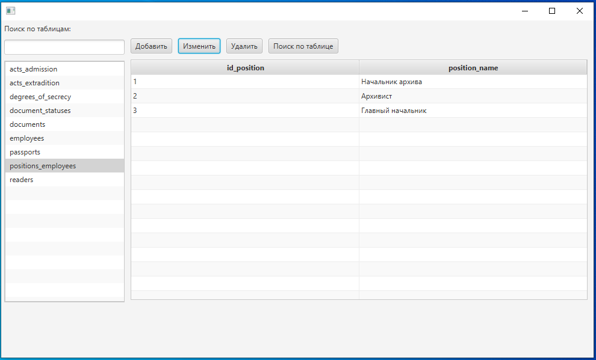
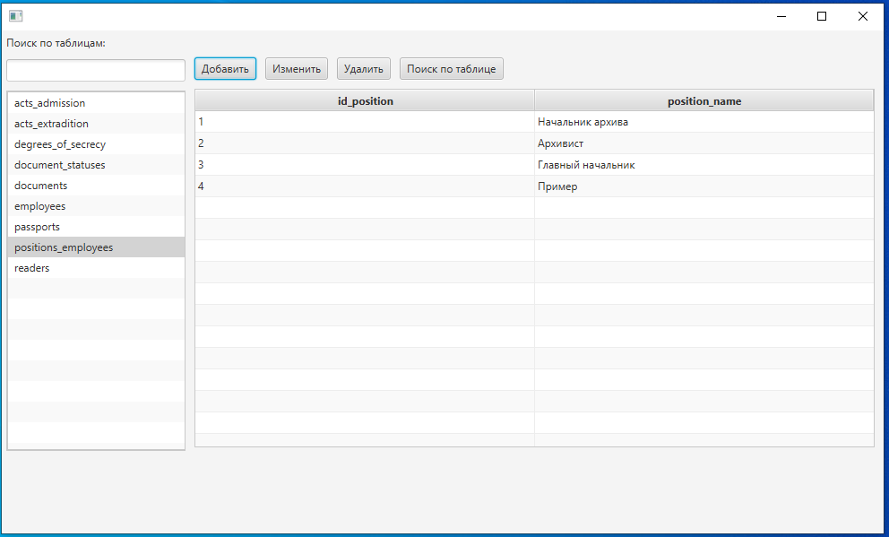

# DatabaseManager - GUI приложение, предоставляющее CRUD операции для таблиц из бд PostgeSQL.
Приложение является учебный проектом, поэтому не предоставляет API для использования.
Используемый стек - Java, JavaFX, JDBC, PostgeSQL, Log4J2
Reflection API (пожалуй самое интересное, подробнее в CrudDAOJdbcImpl.java)

Благодаря данному проекту получил представление о  JavaFX, Reflection API, JDBC, аннотациях (написал две свои, см. package Annotation).

Ниже приведенны скриншоты работы программы:
1. Сцена авторизации. Логин и пароль проверяются из таблицы users.

2.Запуск главного окна. Слева все public таблицы, имеющиеся в бд:

3. Пример выбора таблицы из списка и поиск по списку таблиц:

4. Пример добавления новой записи в выбранную таблицу. После нажатия кнопки "Добавить" откроется новое окно:

5. Пример изменения записи из бд по кнопке "Изменить":

6. Пример удаления записи из таблицы. Сначала добавим еще одну строку, а затем удалим предпоследнюю строку по списку:

7. После нажатия кнопки "Поиск по таблице" откроется новое окно для поиска по любым колонкам таблицы:

Следует заметить, что открывающиеся окна генерируются динамически путем использования
объекта сущности таблицы (используется Reflection API). Пример окна для таблицы с большим числом колонок:

8. Пример поиска:

Искать можно и по нескольким колонкам одновременно:

В данном случае таблица пуста, так как нет строк, удовлетворяющих условиям поиска.

9. Сгенерированные динамически (благодаря Reflection API и аннотациям) SQL запросы в логах:

